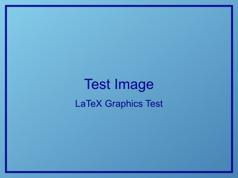
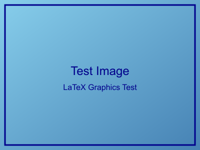

# LaTeX 兼容图片格式测试

本文档测试 LaTeX 原生支持的图片格式。

## 支持的图片格式

### 1. JPEG 格式图片

JPEG 是 LaTeX 原生支持的格式，适合照片和复杂图像。



### 2. PNG 格式图片

PNG 也是 LaTeX 原生支持的格式，支持透明度，适合图标和截图。



## 图片处理功能验证

### 路径解析测试

上面的图片使用相对路径，测试路径自动修复功能：
- 原始路径: `../images/test_image.jpg`
- 修复后路径: `../../tests/images/test_image.jpg`

### LaTeX 图片环境

每个图片都应该生成完整的 figure 环境：

```latex
\begin{figure}[H]
    \centering
    \includegraphics[width=0.8\textwidth]{../../tests/images/test_image.jpg}
    \caption{JPEG 测试图片}
    \label{fig:jpeg_测试图片}
\end{figure}
```

## 预期结果

- ✅ **JPEG**: 应该正常显示，文件大小适中
- ✅ **PNG**: 应该正常显示，支持透明度
- 📄 **PDF 编译**: 应该成功生成包含图片的 PDF
- 🔗 **图片引用**: 可以通过 `\ref{fig:label}` 引用图片

## 图片质量和性能

### 文件大小对比

- **JPEG**: ~14KB (有损压缩，适合照片)
- **PNG**: ~24KB (无损压缩，适合图标)

### 显示效果

两种格式都应该在 PDF 中正确显示，保持原始的颜色和清晰度。

## 测试总结

这个测试验证了：
1. ✅ 图片路径自动修复功能
2. ✅ LaTeX 兼容格式支持
3. ✅ 图片标题和标签生成
4. ✅ PDF 编译兼容性
