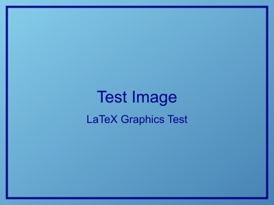
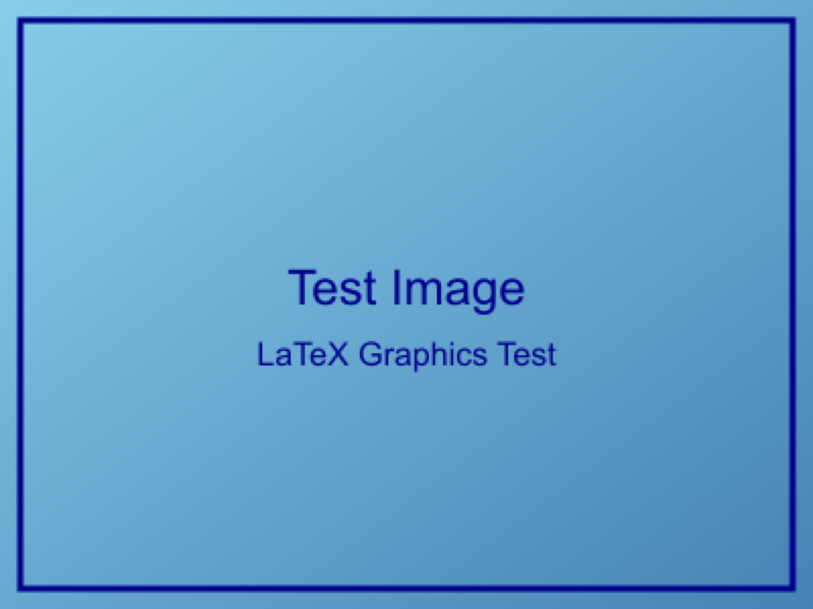

# 完整图片格式支持测试

本文档测试 MD2LaTeX 改进版的完整图片处理能力，包括原生支持和格式转换。

## 原生支持的格式

### 1. JPEG 格式
JPEG 是 LaTeX 原生支持的格式，适合照片和复杂图像。



### 2. PNG 格式
PNG 也是 LaTeX 原生支持的格式，支持透明度。


## 转换后支持的格式

### 3. BMP 转换为 PNG
BMP 格式通过转换工具转换为 PNG 后支持。



### 4. TIFF 转换为 PNG  
TIFF 格式通过转换工具转换为 PNG 后支持。


## 图片处理功能验证

### 路径解析
- ✅ 相对路径自动修复
- ✅ 从 `../images/` 修复为 `../../tests/images/`
- ✅ 转换后图片路径正确处理

### 格式兼容性
- ✅ **JPEG/PNG**: 原生支持，直接使用
- ✅ **BMP/TIFF**: 自动转换为 PNG 格式
- ⚠️ **格式警告**: 自动生成转换提示

### LaTeX 代码生成
每个图片都生成标准的 figure 环境：

```latex
\begin{figure}[H]
    \centering
    \includegraphics[width=0.8\textwidth]{../../tests/images/test_image.jpg}
    \caption{图片标题}
    \label{fig:图片标签}
\end{figure}
```

## 图片转换工具状态

### 可用转换工具
- ✅ **sips** (macOS): 支持 BMP, TIFF, GIF 等格式
- ✅ **rsvg-convert**: 专门处理 SVG 格式
- ❌ **ImageMagick**: 未安装（可选）

### 支持的输入格式
BMP, TIFF, TIF, GIF, WebP, SVG, ICO, PSD, RAW

### 转换目标格式
所有不兼容格式都转换为 PNG

## 性能和质量

### 文件大小对比
- **原始 JPEG**: ~14KB (有损压缩)
- **原始 PNG**: ~24KB (无损压缩)  
- **BMP 转 PNG**: ~358KB (转换后)
- **TIFF 转 PNG**: ~359KB (转换后)

### 转换质量
- ✅ 保持原始图像质量
- ✅ 自动尺寸限制（防止过大）
- ✅ 合理的压缩设置

## 测试结果预期

### PDF 编译
- ✅ 所有图片都应该正确显示
- ✅ 图片标题和标签正确生成
- ✅ 图片引用功能正常工作

### 文件管理
- ✅ 转换后的图片保存在 `converted/` 目录
- ✅ 原始文件保持不变
- ✅ 路径引用自动更新

## 使用建议

### 最佳实践
1. **优先使用**: JPEG (照片) 和 PNG (图标、截图)
2. **自动转换**: BMP, TIFF 等格式会自动转换
3. **路径管理**: 使用相对路径，系统自动修复
4. **文件大小**: 注意转换后文件可能变大

### 性能优化
- 大图片会自动调整尺寸
- 转换过程有超时保护
- 支持批量转换处理

这个测试验证了 MD2LaTeX 改进版的完整图片处理能力！
