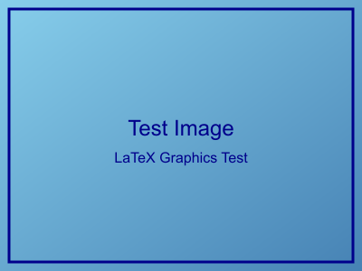

# 图片格式支持测试

本文档用于测试 MD2LaTeX 改进版对不同图片格式的支持能力。

## 支持的图片格式测试

### 1. JPEG 格式图片

JPEG 是最常用的图片格式，支持有损压缩，适合照片。


### 2. PNG 格式图片

PNG 支持无损压缩和透明度，适合图标和截图。


### 3. BMP 格式图片

BMP 是 Windows 位图格式，通常文件较大但兼容性好。



### 4. TIFF 格式图片

TIFF 是高质量的图片格式，常用于印刷和专业图像处理。


## 图片处理功能测试

### 相对路径测试

上面的图片都使用了相对路径 `../images/filename`，测试路径解析功能。

### 图片标题和说明

每个图片都有描述性的 alt 文本，这将成为 LaTeX 中的 caption。

### LaTeX 图片环境

生成的 LaTeX 代码应该包含：
- `\begin{figure}[H]` 环境
- `\includegraphics` 命令
- `\caption{}` 标题
- `\label{fig:}` 标签

## 预期结果

### LaTeX 输出
每个图片应该生成类似以下的 LaTeX 代码：

```latex
\begin{figure}[H]
    \centering
    \includegraphics[width=0.8\textwidth]{../images/test_image.jpg}
    \caption{JPEG 测试图片}
    \label{fig:jpeg_测试图片}
\end{figure}
```

### PDF 编译
- ✅ JPEG: 应该正常显示
- ✅ PNG: 应该正常显示  
- ❓ BMP: 可能需要转换
- ❓ TIFF: 可能需要转换

## 注意事项

1. **路径处理**: 相对路径需要正确解析
2. **格式兼容**: LaTeX 原生支持 PDF、PNG、JPEG
3. **格式转换**: BMP 和 TIFF 可能需要预处理
4. **文件大小**: 大图片可能影响编译速度
5. **中文标题**: 图片标题包含中文字符的处理

## 测试目标

- [x] 创建不同格式的测试图片
- [ ] 测试 Markdown 到 LaTeX 转换
- [ ] 测试 LaTeX 到 PDF 编译
- [ ] 验证图片在 PDF 中的显示效果
- [ ] 检查路径解析是否正确
- [ ] 验证中文标题支持
